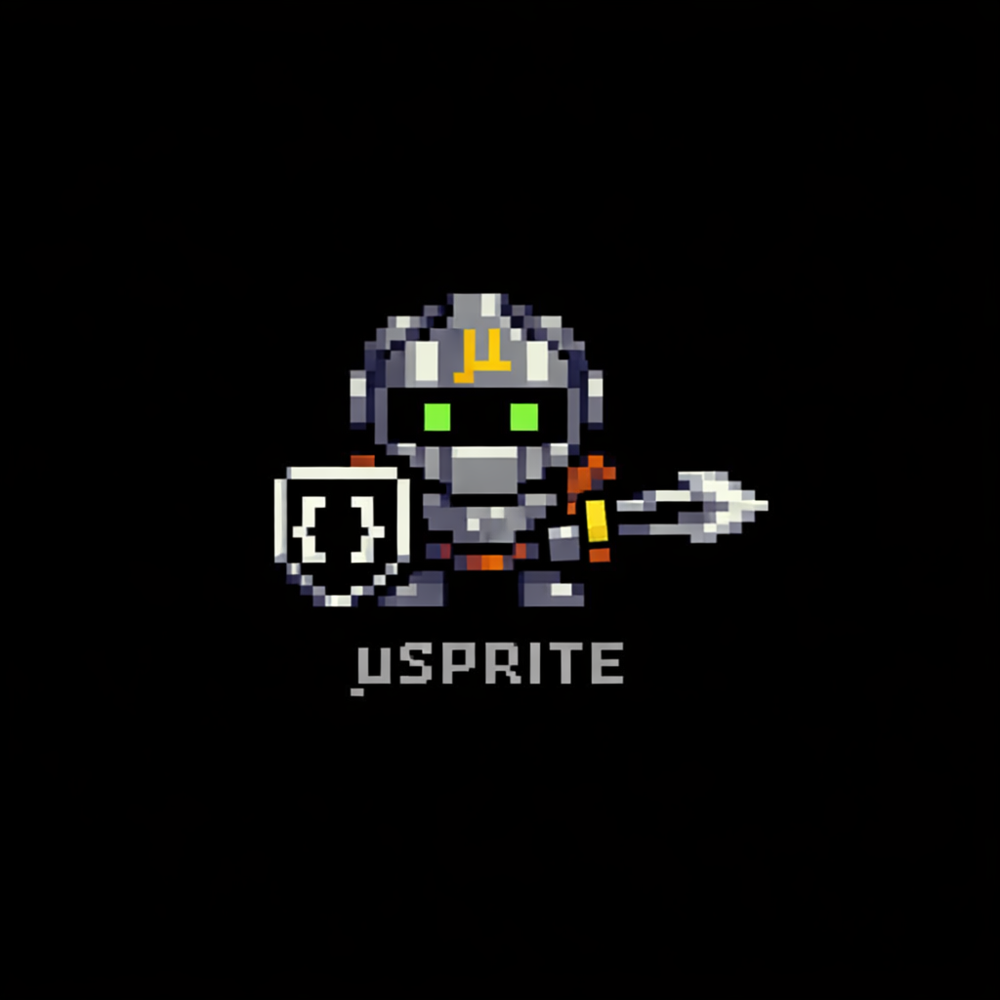

# muScript v0.2




# Why µScript?
µScript is not trying to be another general-purpose language.
It is something different:
A deterministic, replayable, sandbox-friendly scripting language designed for LLM generation and controlled execution.
## 🧠 Designed With LLMs in Mind
Most programming languages were designed for humans first.
µScript explores a different direction:
Deterministic semantics
Stable evaluation order
Explicit effects
Canonical formatting
Token-efficient compressed representation
It is intentionally structured in a way that large language models can generate, transform, and reason about reliably.
## 🔒 Determinism as a First-Class Feature
µScript programs:
Behave identically across platforms
Do not rely on undefined behavior
Have frozen evaluation semantics
Produce deterministic replayable output
If you run the same program with the same inputs and seed, you get the same results.
This makes µScript ideal for:
Simulation engines
Agent experiments
Rule systems
Reproducible research
Deterministic game logic
## 📦 Bytecode + VM Architecture
µScript compiles to bytecode (.mub) and runs inside a VM.
This provides:
Sandboxed execution
Portable artifacts
Identical behavior on desktop and browser (via WebAssembly)
Safe execution of generated code
Introspection and replay
The language is the VM.
## 🗜 Compressed Canonical Mode
µScript supports a unique compressed canonical format:
Module-level symbol tables
Indexed identifiers (#n)
Bracket special forms
S-expression calls
Short effect atoms
This results in:
~30–40%+ byte reduction
Significant token reduction
Deterministic formatting
Reversible transformation between readable and compressed forms
The compressed representation is not a hack — it is a stable, first-class format.
This makes µScript particularly efficient for:
LLM-generated code
Agent pipelines
Embedded scripting payloads
Network transmission
## 🎮 Real Applications, Not Toy Examples
µScript is already used in this repository to build:
µDungeon — a deterministic 10-room roguelike combat simulator
µArena — a batch tournament runner that evaluates strategies across 100+ seeds
These are not trivial demos — they are deterministic simulation systems with reproducible results and measurable token savings.
## 🎯 What µScript Is (And Isn’t)
µScript is ideal for:
Deterministic logic engines
Agent scripting
Simulation and replay systems
Sandboxed execution
Browser-embedded scripting via WASM
µScript is not intended for:
Heavy numeric computing
Systems programming
Large data processing pipelines
Replacing Python or Rust
It fills a specific niche:
A deterministic scripting DSL optimized for LLM generation and controlled execution.
## 🚀 The Big Idea
Most languages optimize for:
Human ergonomics
Runtime performance
Ecosystem size
µScript optimizes for:
Determinism
Replayability
Safety
Canonical structure
Token economy
It explores what programming looks like when LLMs are first-class participants in the development loop.
If you want to build deterministic simulations, sandboxed agents, or reproducible logic systems — and care about token efficiency — µScript might be exactly the tool you didn’t know you needed.

`muc` is the reference µScript v0.2 toolchain in Rust.
It includes:
- Lexer + parser for the EBNF grammar
- Canonical formatter (`mufmt` behavior via `muc fmt`) with readable/compressed modes
- Module loading + name resolution + type/effect checking
- Stack bytecode (`.mub`, header `MUB1`) + VM runtime

## Why v0.2 (Agent + Cost Focus)

µScript is designed by and for agents:
- Small, regular grammar and canonical formatting reduce parsing ambiguity.
- Fewer equivalent spellings means less prompt context spent on style negotiation.
- Deterministic output (`fmt`) makes agent loops stable (plan -> edit -> check -> diff).
- Explicit effects and static checks reduce trial-and-error execution.

v0.2 adds a compressed canonical form optimized for token economy:
- Module symbol table + numeric symbol refs (`$[...]`, `#n`) reduce repeated-name overhead.
- S-expression calls and bracket special forms reduce punctuation noise.
- Optional single-letter effect atoms in compressed mode (`I,F,N,P,R,T,S`).

Practical impact:
- Fewer source tokens usually means lower LLM prompt/completion cost for code-gen and review loops.
- Savings are strongest when identifiers repeat frequently across modules/functions.
- The repo includes token-efficiency regression tests (`tests/token_efficiency.rs`).

Recent app benchmark (`apps/signal_reactor`, measured by `tests/signal_reactor_token_economy.rs`):
- readable bytes: `8266`
- compressed bytes: `5838` (`70.62%`)
- readable lexer-token count: `2753`
- compressed lexer-token count: `2520` (`91.54%`)

## Quickstart

1. Build:

```bash
cargo build
```

2. Canonical format gates:

```bash
cargo run -- fmt --check examples
cargo run -- fmt --check tests/fixtures/parser
cargo run -- fmt --mode=compressed --check tests/fixtures/compressed
```

3. Type + effect check:

```bash
cargo run -- check examples
```

4. Run script:

```bash
cargo run -- run examples/hello.mu
```

You can also run the JSON roundtrip and HTTP examples:

```bash
cargo run -- run examples/json.mu
cargo run -- run examples/http.mu
```

5. Build bytecode:

```bash
cargo run -- build examples/hello.mu -o hello.mub
```

6. Run bytecode directly:

```bash
cargo run -- run hello.mub
```

You can also build/run JSON and HTTP bytecode:

```bash
cargo run -- build examples/json.mu -o json.mub
cargo run -- run json.mub
cargo run -- build examples/http.mu -o http.mub
cargo run -- run http.mub
```

7. Run tests:

```bash
cargo test
```

8. Run semantics/bytecode golden suites:

```bash
cargo test semantics_goldens
cargo test bytecode_golden
```

9. Run fuzz locally (nightly + cargo-fuzz):

```bash
cargo +nightly fuzz run fuzz_lexer -- -max_total_time=30
cargo +nightly fuzz run fuzz_parser -- -max_total_time=30
cargo +nightly fuzz run fuzz_fmt_roundtrip -- -max_total_time=30
cargo +nightly fuzz run fuzz_bytecode_decode -- -max_total_time=30
cargo +nightly fuzz run fuzz_vm_step -- -max_total_time=30
```

## CLI

- `muc fmt <file|dir> [--mode=readable|compressed] [--check]`
- `muc check <file|dir>`
- `muc run <file.mu|file.mub> [-- args...]`
- `muc build <file.mu> -o out.mub`

Example modules:
- `examples/hello.mu`
- `examples/json.mu`
- `examples/http.mu`

### Compressed Canonical Conversion

Convert a project/dir to compressed canonical form:

```bash
cargo run -- fmt --mode=compressed <file-or-dir>
```

Verify compressed canonical form:

```bash
cargo run -- fmt --mode=compressed --check <file-or-dir>
```

Convert back to readable canonical form:

```bash
cargo run -- fmt --mode=readable <file-or-dir>
```

Readable and compressed forms are syntax variants of the same semantics.

## CI Gates

CI enforces:
- `cargo fmt --all -- --check`
- `cargo test`
- readable fixture format checks
- compressed fixture format checks

Manual workflow:
- `fuzz` workflow dispatch runs each fuzz target for a short smoke duration
